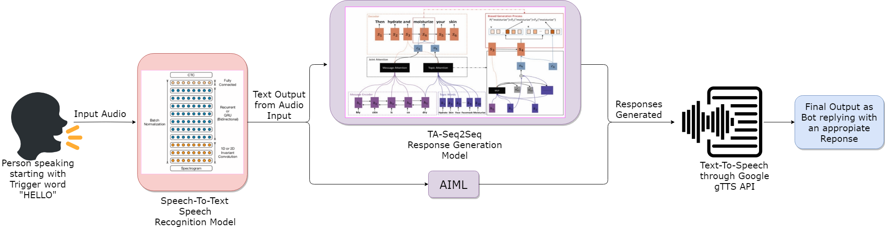

# Conversational Robot

Robotics Club Summer Project 2020

## Aim

The aim of this project was to make a **Talking bot**, one which can pay attention to the user's voice and generate meaningful and contextual responses according to their intent, much like human conversations.

## Ideation

This project was divided into overall three parts :

* [Speech to Text conversion](https://github.com/ShivenTripathi/ConversationalRobot/tree/master/speechRecog) <sup>[1]</sup>
* [Response Generation](https://github.com/ShivenTripathi/ConversationalRobot/tree/master/responseGen) <sup>[2]</sup>
* [Text to speech conversion](https://github.com/ShivenTripathi/ConversationalRobot/tree/master/integration)

## Overall Pipeline of the Project



### Speech Recognition

A Deep Speech 2 like architecture had been made for this purpose. Eventually we used *google-speech-to-text (gstt)* API for the conversion of speech to text transcripts with a WER(Word Error Rate) of *4.7%*.

### Response Generation

The second step in our pipeline is generating conversational responses after we have recognised
input speech content. We tried two distinct response generation models trained on a subset of
OpenSubtitles Dataset.

1. Seq2Seq with Message Attention
2. Topic Aware Seq2Seq with Message Attention

### Text to speech conversion

We used the *google-text-to-speech (gtts)* API for the conversion of text transcripts of responses back to speech.</br>
The API uses *pyglet* to play a temporary mp3 file created from the Response Generator's textual response.

## Installation
Install the required dependencies :

```
$ cd ConversationalRobot/integration
$pip install -r requirements.txt
```
Download the model weights and parameters from [here](https://drive.google.com/drive/folders/1PyIluEr6xfpBJhrqQXDzT-xEVn6e-Xxo?usp=sharing).

## Usage
```
usage: eval_script.py
```
The bot starts up and begins accepting speach input.

### Documentation

Here's a [documentation](https://github.com/ShivenTripathi/ConversationalRobot/blob/master/assets/ConvoBot_Documentation.pdf) of the project. 

### Demonstration

Here's a [video](https://drive.google.com/file/d/1aRBQBq6XCTd5ahrI1LpJvd125vVhJn_l/view) demonstrating the functioning of the bot as well as the use of a GUI in tkinter. 

## References

1. _Deep Speech 2: End-to-End Speech Recognition in English and Mandarin_
   * **Link** : [https://arxiv.org/abs/1512.02595]
   * **Author(s)/Organization** : Baidu Research – Silicon Valley AI Lab
   * **Tags** : Speech Recognition
   * **Published** : 8 Dec, 2015

2. _Topic Aware Neural Response Generation_
   * **Link** : [https://arxiv.org/abs/1606.08340]
   * **Authors** : Chen Xing, Wei Wu, Yu Wu, Jie Liu, Yalou Huang, Ming Zhou, Wei-Ying Ma
   * **Tags** : Neural response generation; Sequence to sequence model; Topic aware conversation model; Joint attention; Biased response generation
   * **Published** : 21 Jun 2016 (v1), 19 Sep 2016 (v2)

3. _Topic Modelling and Event Identification from Twitter Textual Data_
   * **Link** : [https://arxiv.org/abs/1608.02519]
   * **Authors** : Marina Sokolova, Kanyi Huang, Stan Matwin, Joshua Ramisch, Vera Sazonova, Renee Black, Chris Orwa, Sidney Ochieng, Nanjira Sambuli
   * **Tags** : Latent Dirichlet Allocation; Topic Models; Statistical machine translation
   * **Published** : 8 Aug 2016

4. _OpenSubtitles_ (Dataset)
   * **Link** : [http://opus.nlpl.eu/OpenSubtitles-v2018.php]
